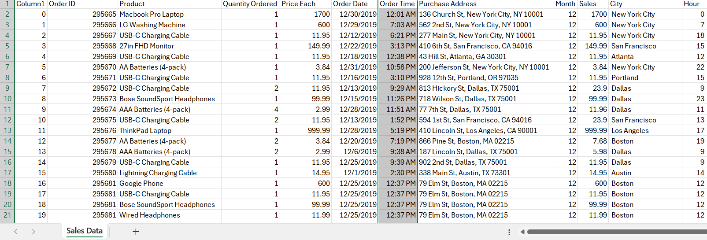
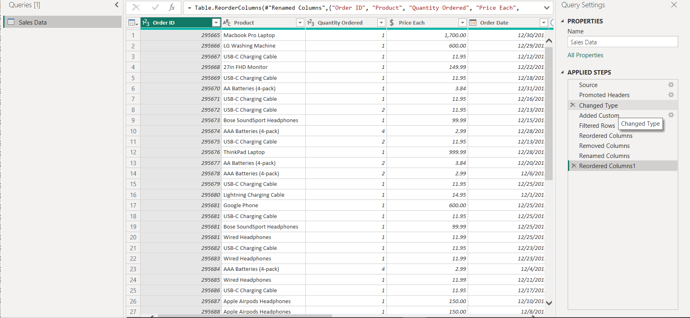
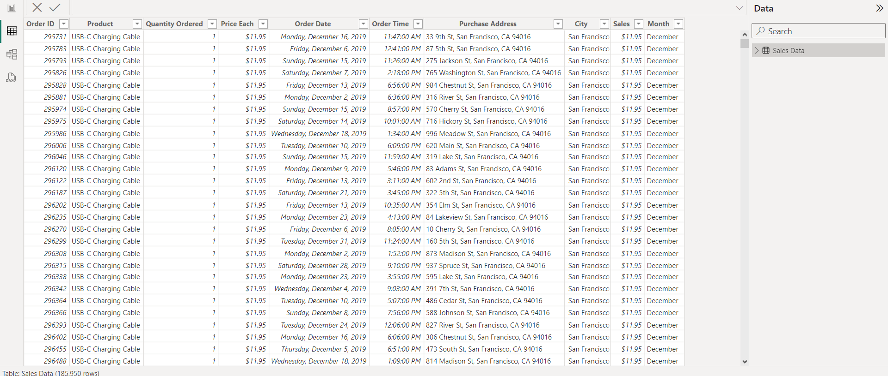
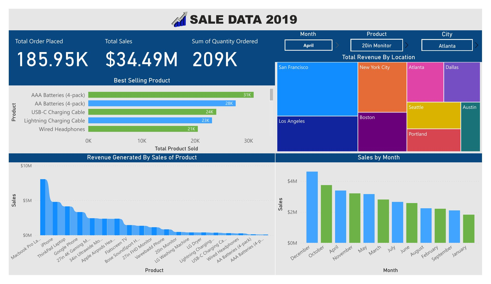
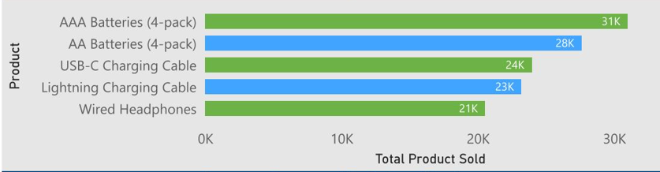
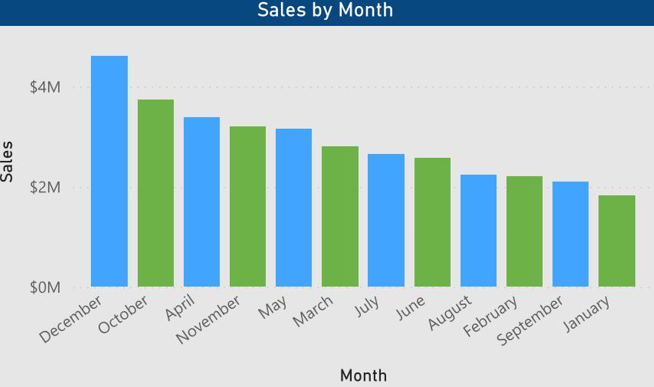
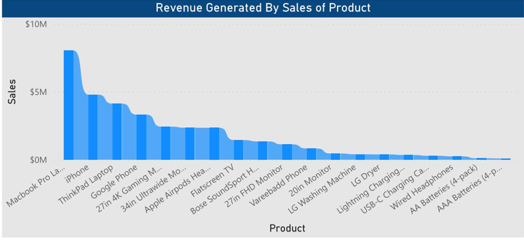

# MeriSkills_Sales_Data_Project

## Introduction

This project involves utilizing Power BI and has been assigned by **Meriskills**, an Indian company, to conduct **sales data** analysis for its client.

## Purpose of the project

To examine the sales data from 2019 of a retail establishment, pinpointing trends, top-selling items, and revenue metrics to inform strategic business decisions.

## Problem Statement

1. How much revenue was generated in total for the year?
2. Which product had the highest sales by count?
3. In which month were sales the highest?
3. Which product yields the highest revenue/profit?
4. What city generated more revenue?

## Data Source

The data source was obtained from MeriSkills.

## Data Cleaning and Transformation

The data underwent cleaning and transformation using the Power Query Editor in Power BI. This included:

- Setting the first row as the header
- Adjusting data types
- Introducing a custom column to represent the month
- Recording columns
- Removing unnecessary columns
- Renaming columns
- Further recording columns

You can observe the transformed table below.

Table during transformation        |  Table after transformation
:---------------------------------:|:-------------------------------
 |    

## Analysis Breakdown

Utilizing Excel and SQL, I undertook a comprehensive data journey encompassing cleaning, transformation, and analysis. Power BI served as a dynamic tool, aiding in the creation of visually compelling representations that narrated the data's story.

## Key Findings:

### Total Order Placed:

Our sales data revealed a robust total of 185.95 thousand orders, signifying a healthy market presence.

### Total Sales: 

A substantial achievement of $34.49 million in sales underscored the company's revenue prowess.

### Quantity of Orders: 

The sum of orders tallied an impressive 209 thousand units, showcasing a strong market demand.

## Which product had the highest sales by count?

### Best selling products:

Identifying the top performers within our product catalogue, I pinpointed AAA Batteries (4-pack) and AA Batteries as our crowning jewels. The visual representations vividly displayed their dominance, laying a solid foundation for strategic business manoeuvres.

## In which month were sales the highest?

### Sales trends over time:

My analysis meticulously tracked sales trends across months. A significant revelation emerged as December's peak sales month, indicating heightened consumer activity.

## Which product yields the highest revenue/profit?

### Revenue generated by sales of product:

The Mac Pro Laptop and iPhone played a major role in boosting the company's revenue, making up a significant portion of its income. Data visuals illustrate that these flagship products made a noteworthy contribution to the company's total earnings.

## What city generated more revenue?

### Revenue generated by City:

San Francisco emerged as the urban centre with the most substantial transactional activity recorded longitudinally, showcasing its dominance in terms of transactional volume over an extended period.

## Compelling Summary and Recommendations:

In summary, the analysis of our sales data indicates a thriving market presence, with certain products shining as frontrunners in our offerings.

## To capitalize on these insights:

### Strategic Product Focus:

Given the success of AAA Batteries (4-pack), AA Batteries, Mac Pro Laptop and iPhone, intensifying marketing efforts and ensuring ample stock availability can further bolster sales.

### Seasonal Campaigns:

The prominence of December as the peak sales month suggests an opportunity for targeted seasonal campaigns, maximizing revenue during this high-demand period.

### Geographical Expansion:

Expanding operations or tailoring marketing strategies specifically for San Francisco could yield amplified returns, considering its consistently high sales volume.

## conclusion:

This comprehensive analysis lays the groundwork for informed decision-making, presenting avenues for growth and optimization within the business landscape.

